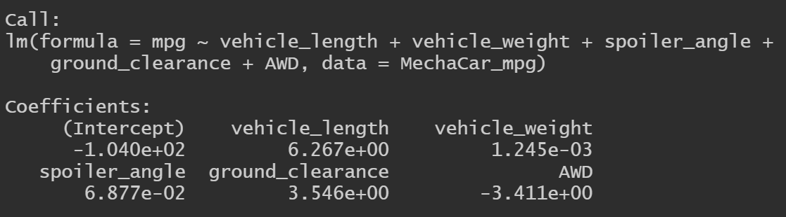
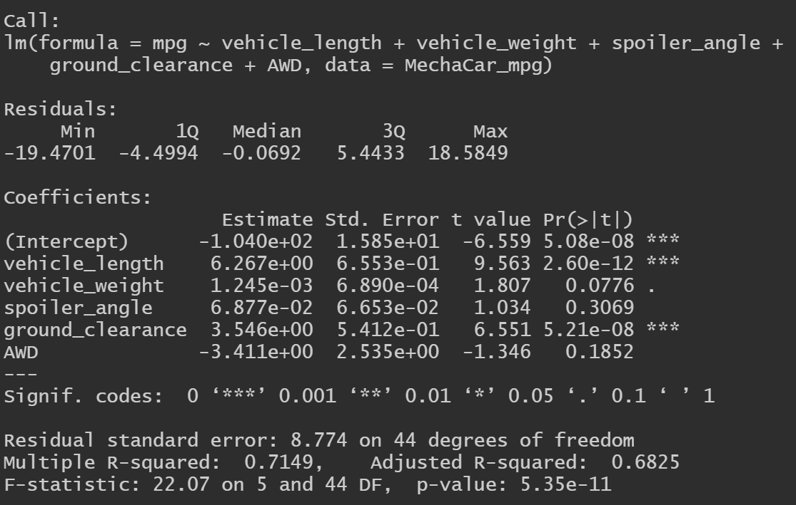
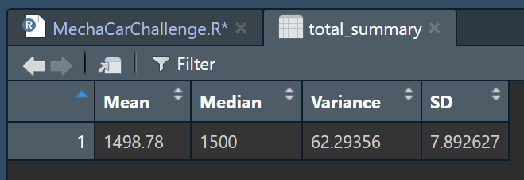
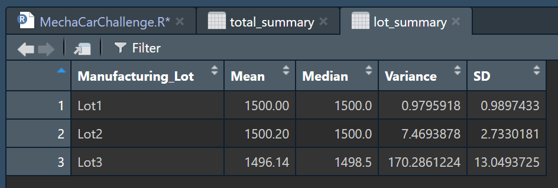
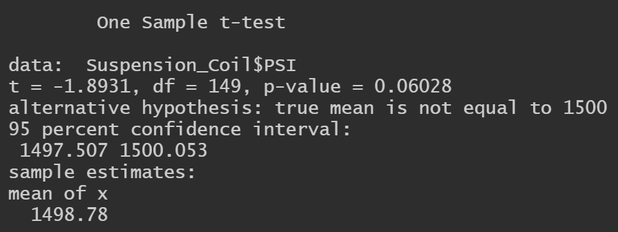
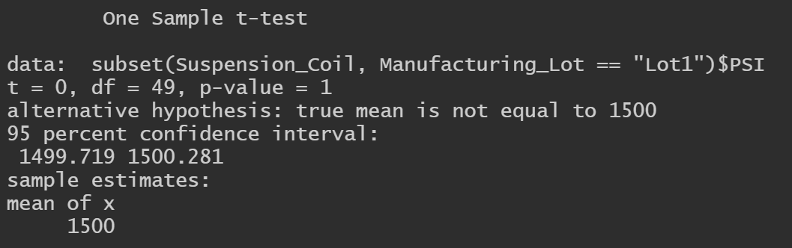
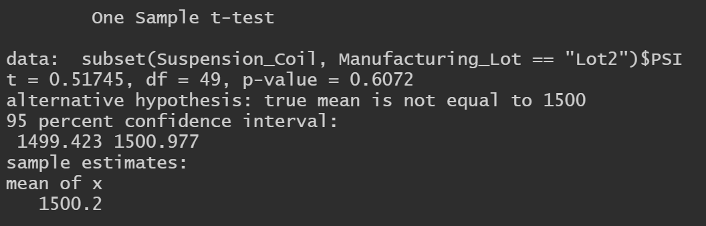
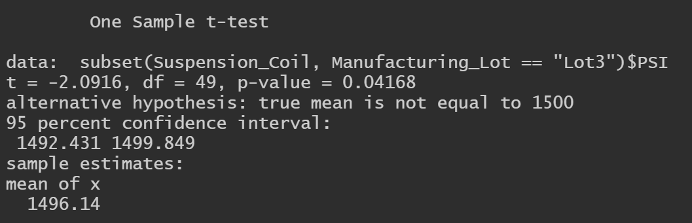

# MechaCar_Statistical_Analysis

## Resources
*   Data Sources:
    *   [MechaCar_mpg.csv](https://github.com/KevinDBrian/MechaCar_Statistical_Analysis/blob/main/Data/MechaCar_mpg.csv)
    *   [Suspension_Coil.csv](https://github.com/KevinDBrian/MechaCar_Statistical_Analysis/blob/main/Data/Suspension_Coil.csv)
*   Software
    *   R 4.1.3
    *   RStudio 2022.02.1-461
    *   Visual Studio Code 1.63.2

## Overview

This challenge asked me to perform four things...
*   Perform multiple linear regression analysis to identify which variables in the dataset predict the mpg of MechaCar prototypes.
*   Collect summary statistics on the pounds per square inch (PSI) of the suspension coils from the manufacturing lots.
*   Run t-tests to determine if the manufacturing lots are statistically different from the mean population
*   Design a statistical study to compare vehicle performance of the MechaCar vehicles against vehicles from other manufacturers. For each statistical analysis, you’ll write a summary interpretation of the findings.

## Linear Regression to Predict MPG (D1)

These results help us answer these questions from the challenge...

*   Which variables/coefficients provided a non-random amount of variance to the mpg values in the dataset?
    *   The vehicle weight and ground clearance have a non random affect on the vehicle MPG as evidence by their calculated p-values. At the same the vehicle spoiler angle and if they were All Wheel Drive (AWD) or not did have a random, or non significant, affect on the MPG.
*   Is the slope of the linear model considered to be zero? Why or why not?    
    *   When looking at the p-value of the model, `p-value: 5.35e-11`, we can see that it is substantially smaller than the normal significance level of 0.05. These findings support rejection of the null hypothesis and indicates the model's slope to not be zero.
*   Does this linear model predict mpg of MechaCar prototypes effectively? Why or why not?
    *   This model does a good job of MPG predictions. This is evidenced by the multiple r-squared value: `Multiple R-squared: 0.7149`. This number tells us that roughly 71.5% of all predications of MPG efficiency can be made by this model, which is considered to be strong correlation. 

## Summary Statistics on Suspension Coils (D2)

These results help us answer this question from the challenge...

*   The design specifications for the MechaCar suspension coils dictate that the variance of the suspension coils must not exceed 100 pounds per square inch. Does the current manufacturing data meet this design specification for all manufacturing lots in total and each lot individually? Why or why not?
    *   According to total summary the coil PSI variance is only `61.3`, which is comfortably within the desired 100 PSI variance expectation. However, when looking at the lots individually, we can see that Lot 3 is over 1.5 times that limit with a variance of `170.3`, which is unacceptably high. To note though, Lots 1 and 2 are both have wonderfully low variance and investigation would be very beneficial to matching these rates going forward.

## T-Tests on Suspension Coils (D3)

The results of all three manufacturing lots: `Mean: 1498.78` and `P-Value: 0.06028`

The above findings show us that we fail to reject the null hypothesis and conclude that the evidence supports that the mean of these three lots combined compared to the population mean are statistically similar. 

The results from Lot 1: `Mean: 1500` and `P-Value: 1` 

What this means for Lot 1 is, with these findings, we fail to reject the null hypothesis since their mean matches exactly with the population mean and their p-value is well above the 0.05 significance level.

The results from Lot 2: `Mean: 1500.2` and `P-Value: 0.6072` 

These findings are similar to that of Lot 1, Lot 2's 1500.2 mean and p-value of .60 means we fail to reject the null hypothesis, the sample mean and population mean or statistically similar.

The results from Lot 3: `Mean: 1496.14` and `P-Value: 0.04168` 

The findings from Lot 3 show outcomes that reject the null hypothesis, a p-value of 0.04168 is below the threshold significance level and the results show a no statistical difference between the lot's mean and the population mean.

## Study Design: MechaCar vs Competition (D4)

This section of the challenge asked me to create a statistical study to compare the MechaCar to their direct competitor.

My study design involves comparing comparable vehicles made by competitor to the MechaCar prototypes. The findings of which are to help direct production towards the best version of the MechaCar and sell the vehicle when a final design enters mass production.

### Metrics to be Tested
For this I thought about the things that are typically most important to customers, so my metrics are...
*   Price
*   Safety Rating
*   Fuel Efficiency

### Hypotheses
#### Price
H0: The mean price of all vehicles are equal.

Ha: The mean price of all vehicles is not equal.

#### Safety Rating
H0: The mean safety rating of all vehicles are equal.

Ha: The mean safety rating of all vehicles is not equal.

#### Fuel Efficiency
H0: The mean highway and city fuel efficiency of all vehicles are equal.

Ha: The mean highway and city fuel efficiency of all vehicles is not equal.

### The Statistical Tests
#### Price
For the price of each vehicle we would want to use a One-Way ANOVA test. This is because we are comparing only the mean cost of the MechaCar to the other competition vehicles.

#### Safety Rating
We would also use a One-Way ANOVA test with our safety rating test. This is for the same reason as price, we are only comparing the mean safety rating to the other competitor vehicles.

#### Fuel Efficiency
For fuel efficiency we would want to use a Two-Way ANOVA test, unlike the other two metrics that use One-Way ANOVAs. We would use the Two-Way here because we are testing more than one independent variable in this situation, highway and city MPGs.

### Required Data
For my analysis to be done well I would need all the price, safety, and efficiency data from each MechaCar prototype. In addition I would need the same data and as much as possible from the most popular brands of vehicle manufacturer that have similar vehicles to MechaCar. The [MechaCar_mpg.csv](https://github.com/KevinDBrian/MechaCar_Statistical_Analysis/blob/main/Data/MechaCar_mpg.csv) from this challenge had 50 rows/prototypes in it, so if I could get the safety and efficiency from these same vehicles that would be ideal. From there we would need to get that same info from the competition. Thankfully these metrics are usually advertised and regularly reported by drivers. Gathering data from the top 3 competitors would give us 200 total vehicles to analyze, which should be a sufficient enough sample size to perform a reasonably accurate analysis. The findings from which would give us great insight to how we should direct our production and final design of the MechaCar!
